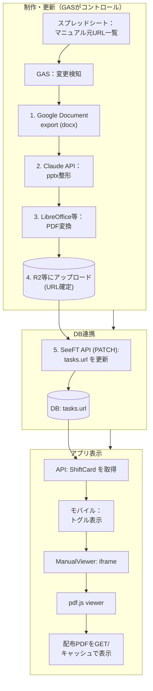
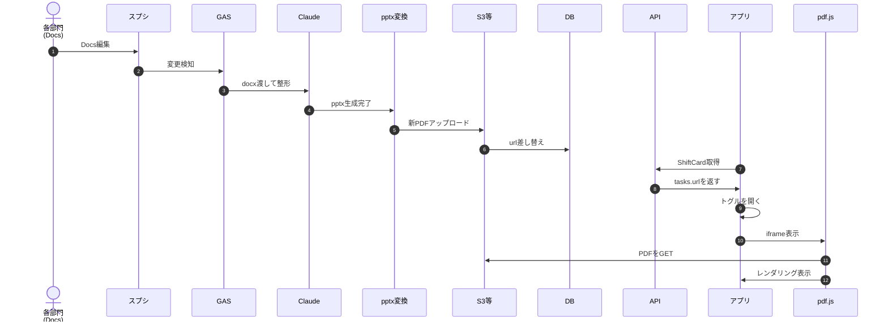
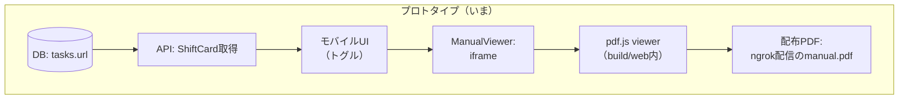

# SeeFT マニュアル表示（トグル内プレビュー）内部挙動解説

## なんのドキュメント？

- スプシに登録したマニュアル（Google document）が、Claude整形→pptx→PDFになり、ページ内のトグルを開くと表示されるまでを、**本番予定**と**プロトタイプ**の両方で説明する。
- マニュアル表示時に毎回重い再ダウンロードになっていないこと（キャッシュが効くこと）を説明する。

---

<aside>
💡

## S3よりCoudflare  R2の方無料で使えて良いらしい

[Pricing](https://developers.cloudflare.com/r2/pricing/)

</aside>

- 前提:
    - manual.pdf × 50個、平均1.8MB → 合計 90MB
    - メンバー300人
    - 技大祭 3日間
    - 1人1日あたりマニュアルを開く回数: 3回と仮定
    - キャッシュが効くので実際のDL =
    1人1マニュアルにつき初回1回だけ
- ストレージ
    - 90MB × $0.023/GB = $0.002/月 ≒ ほぼ0円
- 転送量
    
    
    | **項目** | **使用量** | **無料枠** | **結果** |
    | --- | --- | --- | --- |
    | **ストレージ** | 90MB | 10GB | 無料 |
    | **転送** | 10.8GB | 完全無料 | 無料 |
    | **読み取り** | 300×20=6000回 | 1000万回 | 無料 |
    - 300人 × 50マニュアル × 1.8MB =
    27GB（最大、全員が全マニュアルを開いた場合）
    現実的には1人3〜5マニュアルしか開かない
    → 300人 × 20マニュアル × 1.8MB = 10.8GB

---

## 0. 用語（このドキュメント内）

- **マニュアル元：**Google Documentをインポートして得た .docxファイル
- **整形済みスライド：**Claudeが内容を理解して組み直した pptx
- **配布PDF：** 閲覧用に変換した PDF（例: `manual.pdf`）
- **配信先（配布サーバ/ストレージ）：** PDFの実体がHTTPで配信される場所（本番: S3等、プロトタイプ: ローカル or build成果物をngrok公開）
- **DB：** `tasks.url` に配布PDFのURL住所を保存する場所
- S3：https://qiita.com/shimajiri/items/01ab61a08b58c2cb8acf
- **トグル：** mobileアプリで「マニュアルを見る」を開閉するUI（`ExpansionTile` 内の `ManualViewer` を表示）
- iframe：https://developer.mozilla.org/ja/docs/Web/HTML/Reference/Elements/iframe
- canvas：https://developer.mozilla.org/ja/docs/Web/HTML/Reference/Elements/canvas
- **pdf.js viewer：** PDFをブラウザ内でレンダリングするWebアプリ（`/pdfjs/viewer.html?...`）
- **Service Worker (SW)：** ブラウザ内で動く仲介役。キャッシュ戦略により応答を返す
- **HTTPキャッシュ / disk cache：**ブラウザが保持するHTTPキャッシュ（`disk cache` 表示）

---

## 1. 本番環境（予定）の全体アーキテクチャ（めっちゃ複雑になった気がする）



### 本番での役割分担

- **DB**はPDFのURLを持つだけ（バイナリ保存しない）
    - GASからtask.URLを更新
- GAS
    - 変更検知したらSeeFT APIにキックするだけ（実行時間制限とかもあり）
        
        ```python
        POST /jobs/manual-convert
        { "task_id": 7, "docs_url": "https://docs.google.com/..."
        }
        ```
        
- SeeFT APIサーバ（Goバックエンド）
↓ ジョブを受け取る
1. Google Docsをdocxでexport
2. Claude APIでpptx生成
3. LibreOfficeでPDF変換
4. R2にアップロード
5. tasks.urlを更新（自分自身のDB）
- **配信先（配信サーバー）**がPDFの実体（HTTPでGET可能）を持つ
- **フロント/トグル**は `tasks.url` を受け取り、`iframe + pdf.js viewer` 経由でPDFを表示する

---

## 2. 本番フロー図（本番の「変更→表示」まで）



---

## 3. いまのプロトタイプ（現状）アーキテクチャ

いまの構成は「スプシ→Claude→PDF生成」が自動化されているというより、**配布PDF（またはPDF互換ビューアの入口）を用意して `tasks.url` にURLを入れて表示確認している**段階です。



### 本番環境と何が違うか

```python
/Users/eisaki/workspace/SeeFT/mobile/build/web/
├── index.html        ← Flutter Webアプリ
├── manual.pdf        ← PDFの実体（ここに直置き）
└── pdfjs/
└── viewer.html 等

python3 -m http.server 8766
```

- build/web/ ディレクトリ全体をHTTPで配信
    - PDF配信サーバーとFlutter
    Webアプリが同一サーバーです。

```python
https://1c0d-125-199-36-141.ngrok-free.app/
├── /          → Flutter Webアプリ（index.html）
├── /manual.pdf → PDFの実体
└── /pdfjs/viewer.html → pdf.jsビューア
```

| **比較項目** | **今のプロトタイプ** | **本番** |
| --- | --- | --- |
| **PDF置き場** | `build/web/` に直置き | R2等の専用ストレージ |
| **Flutter Webと同居** | している（密結合） | 分離する（疎結合） |
| **URL** | ngrokで毎回変わる | 固定URL |
| **配信方法** | pythonサーバ | R2がHTTPで直接配信 |

---

## 4. いまの「マニュアルが出るまで」実装フロー（コード起点）

### 4.1 トグルを開くと何が起きるか

mobile側では、トグル内のマニュアル欄で `ManualViewer(url: ...)` を表示しています。

- `mobile/lib/widgets/shift_card.dart`
    - `_InlineManualExpansion` の `build()` 内で `if (_isExpanded) ... ManualViewer(url: widget.url)` の形になっている
    - つまり、**トグルを開いたタイミングで iframe を生成**します
        - iframe：https://developer.mozilla.org/ja/docs/Web/HTML/Reference/Elements/iframe

### 4.2 `ManualViewer` はURLからどう表示先を決めるか

- `mobile/lib/widgets/manual_viewer.dart`
    - `_toEmbeddableUrl()` が URL を変換します
    - Google Docs系なら `/preview` に寄せます
    - **PDF URLなら**次のように `pdf.js viewer` を入口にします（重要）:
        - `/pdfjs/viewer.html?file=<encoded PDF URL>`

### 4.3 iframe + pdf.js viewer がやっていること

1. `ManualViewer` が iframe を作成し、`src` に pdf.js viewer を指定する
2. pdf.js viewer が `file` パラメータのPDF URLへ `GET`
3. pdf.js がブラウザ内でPDFをレンダリング（canvas等）
    - canvas：https://developer.mozilla.org/ja/docs/Web/HTML/Reference/Elements/canvas
4. レンダリング結果が iframe 内としてトグル内に見える

---

## 5. 「毎回PDFをダウンロードしない」理由（キャッシュの説明）

自分がDevTools開いて試したところ、 `Network` で以下が出ていた:

- `manual.pdf` が `200 OK (from service worker)` や `200 OK (from disk cache)` として返ってた
- 場合によっては `304 Not Modified` が出る


これらはトグルを開くたび毎回フルDLしていないことの根拠になる

### 5.1 どのキャッシュが効いているか

- **Service Worker**（SW）
    - ブラウザが `manual.pdf` を要求した際、SWがキャッシュから応答することがある
    - DevTools上は `(ServiceWorker)` 基本表示だった
    
    
    
- **HTTPキャッシュ / disk cache**
    - SWではなく、ブラウザのディスク上キャッシュが返す場合がある
    - Bypass for NetworkをONにしたら、DevTools上は `(disk cache)` 表示になった
    
    
    
- **304 Not Modified**
    - 変更が無い場合、再DLを避ける（再利用）挙動

### 5.2 それでも GET は飛ぶの？

**GETリクエスト自体は発生する。**
ただし、**GETリクエスト≠**ネットワークから毎回ファイル本体をダウンロード
実際にはキャッシュからの応答（SW/disk cache/304再利用）になっている、という理解です。

---

## 6. サーバ/配信側の役割（重要と思う）

`manual.pdf` を開ける = **PDFの実体を返すHTTPサーバがどこかに存在**します。

- プロトタイプ: `build/web` や `docs/manual` を `python -m http.server` 等で配信し、それをngrok公開
- 本番: S3等へアップロードして、固定URL（またはバージョン付きURL）で配信

DBはバイナリを持たず、基本はURLの登録帳になる想定

---

## 7. なんで DBじゃなくてS3使ったほうがいいの？

### 1. パフォーマンス

- 内部構造の違い
    
    DBがデータを返すまでの流れ：（DBはSQLを処理するために設計されているので、バイナリの塊を返
    すことは苦手）
    
    クライアント
    
    ↓ SQLクエリ
    
    DB（PostgreSQL等）
    
    → クエリをパース
    
    → インデックス検索
    
    → バイナリデータを読み出し
    
    → レスポンスに乗せて返す
    
    S3がファイルを返すまでの流れ:
    
    クライアント
    
    ↓ HTTP GET /manual.pdf
    
    S3
    
    → ファイルをそのまま返す
    
- DBはSQLクエリに最適化されている
- PDFはHTTPでのファイルの配信に特化したサーバ（S3等）の方が速く配信で
きる

### 2. 責務の分離

- DB  → 「どのタスクにどのPDFが対応するか」という関係性を管理
- S3  → PDFのバイナリを配信することに専念

それぞれが得意なことをやる

### 3. 更新が楽

- PDFを差し替えたいとき、S3のファイルを上書きするだけ
- 
- PDFを差し替えたいとき、S3のファイルを上書きするだけ
- DBのURLは変えなくていい（同じURLのまま中身だけ変わる）

---

## 8. 参考: 今確認すべき主要ファイル（実装の根拠）

- `mobile/lib/widgets/shift_card.dart`
    - トグルを開いたときに `ManualViewer` を表示する箇所
- `mobile/lib/widgets/manual_viewer.dart`
    - URLを埋め込み表示用に変換する箇所（PDF→pdf.js viewer入口）
- `mobile/lib/pages/shift_card_manual_demo_page.dart`
    - デモ用に `MANUAL_PDF_URL` を `ShiftCardData.url` に入れる箇所
- `mobile/lib/main_demo_web.dart`
    - Web向けデモのエントリポイント

---

## 9. 次の改善（任意）

トグル開閉で `ManualViewer`（iframe）自体は生成されます。キャッシュが効いている前提でも、より快適にしたい場合は以下が選択肢です。

- iframeを破棄せず `Offstage` などで保持する（レンダリング再コストを減らす）
- 配信サーバに `Cache-Control` を適切に付与する（再利用率を上げる）
- PDF URLに `?v=<timestamp>` のようなバージョンパラメータを使い、更新時のみキャッシュ破棄する