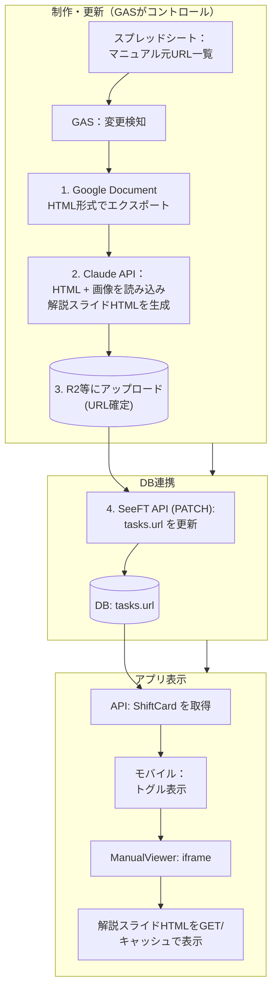
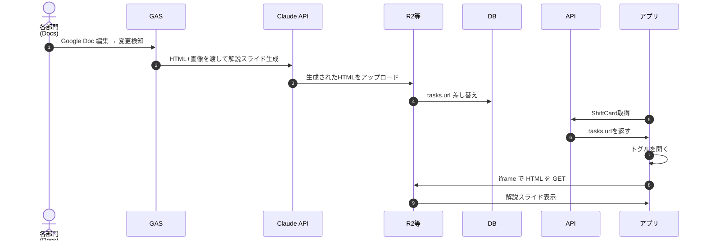
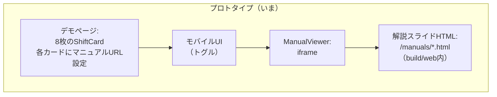

# SeeFT マニュアル表示（トグル内プレビュー）内部挙動解説

## なんのドキュメント？

- Google Document から解説スライド（HTML）が生成され、シフトカードのトグルを開くと表示されるまでを、**本番予定**と**プロトタイプ**の両方で説明する。
- マニュアル表示時に毎回重い再ダウンロードになっていないこと（キャッシュが効くこと）を説明する。

---

## 旧パイプラインからの変更点

```
旧: Google Doc → docx → pptx（Claude整形） → PDF（LibreOffice） → pdf.js viewer で表示
新: Google Doc → HTML zip ダウンロード → Claude が内容を読んで再構成 → 自己完結HTML → iframe で直接表示
```

**消えたもの：**
- pptx変換（python-pptx）
- PDF変換（LibreOffice headless）
- pdf.js viewer（PDFレンダリング用Webアプリ）

**変わったポイント：**
- 中間形式が2つ（pptx, PDF）消えて、HTML→HTMLの1ステップになった
- 画像はBase64 data URIで埋め込むため、HTMLファイル1つで完結（外部依存なし）
- pdf.jsのiframeがそのままHTMLのiframeに置き換わった（ManualViewerは`.html`をそのまま表示する）

---

<aside>
💡

## S3よりCloudflare R2の方が無料で使えて良いらしい

[Pricing](https://developers.cloudflare.com/r2/pricing/)

</aside>

- 前提:
    - 解説スライドHTML × 50個、平均2MB → 合計 100MB（Base64画像埋め込みのため旧PDFより若干大きい）
    - メンバー300人
    - 技大祭 3日間
    - 1人1日あたりマニュアルを開く回数: 3回と仮定
    - キャッシュが効くので実際のDL = 1人1マニュアルにつき初回1回だけ
- ストレージ
    - 100MB × $0.023/GB = $0.002/月 ≒ ほぼ0円
- 転送量

    | **項目** | **使用量** | **無料枠** | **結果** |
    | --- | --- | --- | --- |
    | **ストレージ** | 100MB | 10GB | 無料 |
    | **転送** | 12GB | 完全無料 | 無料 |
    | **読み取り** | 300×20=6000回 | 1000万回 | 無料 |
    - 300人 × 50マニュアル × 2MB = 30GB（最大、全員が全マニュアルを開いた場合）
    現実的には1人3〜5マニュアルしか開かない
    → 300人 × 20マニュアル × 2MB = 12GB

---

## 0. 用語（このドキュメント内）

- **マニュアル元：** Google Document（HTML形式でダウンロードして取得）
- **解説スライド：** Claudeがマニュアル元の内容を理解して再構成した自己完結HTML（Base64画像埋め込み）
- **配信先（配信サーバ/ストレージ）：** HTMLの実体がHTTPで配信される場所（本番: R2等、プロトタイプ: `build/web/manuals/` をngrok公開）
- **DB：** `tasks.url` に解説スライドのURL住所を保存する場所
- R2：https://developers.cloudflare.com/r2/
- **トグル：** mobileアプリで「マニュアルを見る」を開閉するUI（`ExpansionTile` 内の `ManualViewer` を表示）
- iframe：https://developer.mozilla.org/ja/docs/Web/HTML/Reference/Elements/iframe
- **Service Worker (SW)：** ブラウザ内で動く仲介役。キャッシュ戦略により応答を返す
- **HTTPキャッシュ / disk cache：** ブラウザが保持するHTTPキャッシュ（`disk cache` 表示）

---

## 1. 本番環境（予定）の全体アーキテクチャ



### 本番での役割分担

- **DB** はHTMLのURLを持つだけ（バイナリ保存しない）
    - GASがSeeFTのAPIにキックしたら、APIサーバ（Go）が変換〜tasks.url更新まで全部やる
- GAS
    - 変更検知したらSeeFT APIにキックするだけ（実行時間制限とかもあり）

        ```
        POST /jobs/manual-convert
        { "task_id": 7, "docs_url": "https://docs.google.com/..." }
        ```

- SeeFT APIサーバ（Goバックエンド）
  1. Google DocsをHTML形式でエクスポート（HTML + images/）
  2. Claude APIに渡して解説スライドHTML生成（Base64画像埋め込み済み）
  3. R2にアップロード
  4. tasks.urlを更新（自分自身のDB）
- **配信先（配信サーバー）** がHTMLの実体（HTTPでGET可能）を持つ
- **フロント/トグル** は `tasks.url` を受け取り、**iframe で直接HTML表示**する（pdf.js は不要）

### なぜPDFではなくHTMLか

| やりたいこと | PDF | HTML |
|---|---|---|
| 章ごとの折りたたみトグル | 不可能 | `<details>` で実現可能 |
| リンク付き目次 | 一応可能 | ページ内アンカーで自然に動く |
| スマホ画面幅に最適化 | 固定レイアウト（拡大縮小で対応） | 画面幅に自動適応 |
| 当日の急な変更反映 | 再生成→再配信が必要 | Google Doc変更→GAS+AIで自動更新可能 |
| 図の拡大 | ビューワー依存 | ピンチズームやタップ拡大をCSS/JSで実装可能 |

---

## 2. 本番フロー図（本番の「変更→表示」まで）



---

## 3. いまのプロトタイプ（現状）アーキテクチャ

いまの構成は、**解説スライドHTML（slide_v2.html）をASCII名で `build/web/manuals/` に配置し、デモページのシフトカードからiframeで表示している**段階です。



### ファイル構成

```
mobile/build/web/
├── index.html           ← Flutter Webアプリ（デモページ）
├── manuals/             ← 解説スライドHTML（8マニュアル分）
│   ├── haisen.html      ← 配線マニュアル (4.7MB)
│   ├── parking.html     ← 駐車場設営・撤収 (272KB)
│   ├── annai.html       ← 案内所準備・片付け (784KB)
│   ├── honbu.html       ← 本部設営 (79KB)
│   ├── nobori.html      ← のぼり広告片付け (176KB)
│   ├── buppan.html      ← 物販テント (1.7MB)
│   ├── wars.html        ← 幼稚園WARS (5.6MB)
│   └── obake.html       ← お化け屋敷 (4.4MB)
└── pdfjs/               ← 旧PDF表示用（現在はHTML直接表示のため未使用）
    └── viewer.html 等
```

### 起動方法

```bash
# HTTPサーバー起動
python3 -m http.server 8765 -d mobile/build/web

# 別ターミナルでngrok
ngrok http 8765
```

### マニュアル名とASCII名の対応

| マニュアル名 | ASCII名 | サイズ |
|---|---|---|
| 01_44th_配線マニュアル | haisen.html | 4.7MB |
| 01_44th_駐車場設営・撤収マニュアル | parking.html | 272KB |
| 02_44th_案内所準備・片付けマニュアル | annai.html | 784KB |
| 01_44th_本部設営マニュアル | honbu.html | 79KB |
| 01_44th_のぼり広告片付けマニュアル | nobori.html | 176KB |
| 44th_06_技大祭物販テントマニュアル | buppan.html | 1.7MB |
| 44th_幼稚園WARSコラボブース当日マニュアル | wars.html | 5.6MB |
| 44th_企画マニュアル_お化け屋敷 | obake.html | 4.4MB |

### 本番環境と何が違うか

| **比較項目** | **今のプロトタイプ** | **本番** |
| --- | --- | --- |
| **HTML置き場** | `build/web/manuals/` に直置き | R2等の専用ストレージ |
| **Flutter Webと同居** | している（密結合） | 分離する（疎結合） |
| **URL** | ngrokで毎回変わる | 固定URL |
| **配信方法** | pythonサーバ | R2がHTTPで直接配信 |
| **マニュアル生成** | Claudeが手動で生成 | GAS + Claude API で自動生成 |
| **シフトカード連携** | デモページにハードコード | DB（tasks.url）から取得 |

---

## 4. いまの「マニュアルが出るまで」実装フロー（コード起点）

### 4.1 デモページのシフトカード構成

- `mobile/lib/pages/shift_card_manual_demo_page.dart`
    - 8枚のシフトカードをリスト表示
    - 各カードに `url: '/manuals/haisen.html'` 等のマニュアルURLを設定
    - `ListView.separated` で縦スクロール表示

### 4.2 トグルを開くと何が起きるか

- `mobile/lib/widgets/shift_card.dart`
    - `_InlineManualExpansion` の `build()` 内で `if (_isExpanded) ... ManualViewer(url: widget.url)` の形になっている
    - つまり、**トグルを開いたタイミングで iframe を生成**する
        - iframe：https://developer.mozilla.org/ja/docs/Web/HTML/Reference/Elements/iframe

### 4.3 `ManualViewer` はURLからどう表示先を決めるか

- `mobile/lib/widgets/manual_viewer.dart`
    - `_toEmbeddableUrl()` が URL を変換する
    - Google Docs系なら `/preview` に寄せる
    - PDF URLなら `/pdfjs/viewer.html?file=<encoded PDF URL>` に変換（旧方式、今は使わない）
    - **HTMLのURL（`.html`）はそのまま返す** → iframe に直接表示される

### 4.4 iframe でHTMLが表示されるまで

1. `ManualViewer` が iframe を作成し、`src` にHTMLのURL（例: `/manuals/haisen.html`）を指定する
2. ブラウザがHTMLを `GET` する
3. HTMLは自己完結（CSS + Base64画像が全て埋め込み済み）なので、追加リソースのリクエストなし
4. HTMLがそのまま iframe 内にレンダリングされ、トグル内に表示される

**旧方式（PDF）との違い：** pdf.js が canvas にレンダリングする工程が不要。HTMLはブラウザがネイティブにレンダリングするため、表示が速い。

---

## 5. 「毎回HTMLをダウンロードしない」理由（キャッシュの説明）

### 5.1 どのキャッシュが効くか

- **Service Worker**（SW）
    - ブラウザが `.html` を要求した際、SWがキャッシュから応答することがある
    - DevTools上は `(ServiceWorker)` 表示

- **HTTPキャッシュ / disk cache**
    - SWではなく、ブラウザのディスク上キャッシュが返す場合がある
    - DevTools上は `(disk cache)` 表示

- **304 Not Modified**
    - 変更が無い場合、再DLを避ける（再利用）挙動

### 5.2 それでも GET は飛ぶの？

**GETリクエスト自体は発生する。**
ただし、**GETリクエスト≠** ネットワークから毎回ファイル本体をダウンロード。
実際にはキャッシュからの応答（SW/disk cache/304再利用）になる。

### 5.3 HTMLの場合の追加メリット

HTMLファイルにはBase64画像が埋め込まれているため、**HTMLファイル1つをキャッシュすればそのマニュアルの全リソースがキャッシュされる**。PDFの場合と同様、画像を別途取得する必要はない。

---

## 6. サーバ/配信側の役割

解説スライドHTMLを開ける = **HTMLの実体を返すHTTPサーバがどこかに存在**する。

- プロトタイプ: `build/web/manuals/` を `python -m http.server` 等で配信し、それをngrok公開
- 本番: R2等へアップロードして、固定URL（またはバージョン付きURL）で配信

DBはバイナリを持たず、基本はURLの登録帳になる想定。

---

## 7. なんで DBじゃなくてR2使ったほうがいいの？

### 1. パフォーマンス

- DBがデータを返すまでの流れ（DBはSQLを処理するために設計されているので、HTMLの塊を返すことは苦手）：

    クライアント → SQLクエリ → DB → クエリをパース → インデックス検索 → データ読み出し → レスポンス

- R2がファイルを返すまでの流れ：

    クライアント → HTTP GET /manuals/haisen.html → R2 → ファイルをそのまま返す

- DBはSQLクエリに最適化されている
- HTMLファイルはHTTPでのファイル配信に特化したサーバ（R2等）の方が速く配信できる

### 2. 責務の分離

- DB → 「どのタスクにどのマニュアルが対応するか」という関係性を管理
- R2 → HTMLファイルを配信することに専念

それぞれが得意なことをやる。

### 3. 更新が楽

- HTMLを差し替えたいとき、R2のファイルを上書きするだけ
- DBのURLは変えなくていい（同じURLのまま中身だけ変わる）
- 当日の急な変更（集合場所変更等）にも、Google Doc修正 → GAS → Claude API → R2上書き で対応可能

---

## 8. 参考: 今確認すべき主要ファイル（実装の根拠）

| ファイル | 役割 |
|---|---|
| `mobile/lib/widgets/shift_card.dart` | トグルを開いたときに `ManualViewer` を表示する箇所 |
| `mobile/lib/widgets/manual_viewer.dart` | URLを埋め込み表示用に変換する箇所（HTML URLはそのまま通す） |
| `mobile/lib/pages/shift_card_manual_demo_page.dart` | 8枚のシフトカードに各マニュアルURLを設定するデモページ |
| `mobile/lib/main_demo_web.dart` | Web向けデモのエントリポイント |
| `docs/manuals/*/slide_v2.html` | 解説スライドのソース（Base64画像埋め込み済みHTML） |
| `mobile/build/web/manuals/*.html` | 配信用にASCII名でコピーされた解説スライド |

---

## 9. 解説スライドHTML生成の設計

### なぜSKILL.md（統一変換ルール）ではなく手動生成か

統一ルールでAI変換を試みたが、各マニュアルの形式がバラバラで品質が出なかった。
「わかりやすく整理する」は**コンテンツの意味を理解した上での編集判断**なので、変換ルールの集合では本質的に対応できない。

### AI生成プロンプトの設計方針（2層構造）

| 層 | 内容 | 例 |
|---|---|---|
| **Layer 1: ハードルール**（機械的・再現性100%） | カラースキーム、CSS、除外ルール、出力形式 | 色: #C89932等、電話番号除外、Base64画像、scroll-snap |
| **Layer 2: ソフトガイドライン**（判断の方向性だけ） | 情報構成、レイアウト判断 | 「読み手が当日迷わないように再構成」「タスク→スケジュール→物品の順」 |

### 元ドキュメントのテンプレート統一が鍵

テンプレートで以下が統一されていれば、AI処理の再現性と品質が向上する：
- 見出しレベル（H1=マニュアル名、H2=大セクション、H3=サブセクション）
- 表の形式（タイムスケジュール: 時間|内容、物品: 物品名|個数|備考）
- 画像の直後にキャプション
- 基本情報（場所・時間・人数）の書き方

---

## 10. 次の改善（任意）

- トグル開閉で `ManualViewer`（iframe）自体は生成される。キャッシュが効いている前提でも、より快適にしたい場合は以下が選択肢：
    - iframeを破棄せず `Offstage` などで保持する（レンダリング再コストを減らす）
    - 配信サーバに `Cache-Control` を適切に付与する（再利用率を上げる）
    - HTML URLに `?v=<timestamp>` のようなバージョンパラメータを使い、更新時のみキャッシュ破棄する
- 解説スライドHTMLの改善：
    - 文字サイズの引き上げ（スマホ最適化）
    - 大見出し/小見出しのスタイル差を強化
    - ページ内アンカーリンク付き目次を先頭に追加
    - 章ごとの折りたたみトグル（`<details>/<summary>`）
    - 情報の順番最適化（基本情報→タスク→スケジュール→物品）
