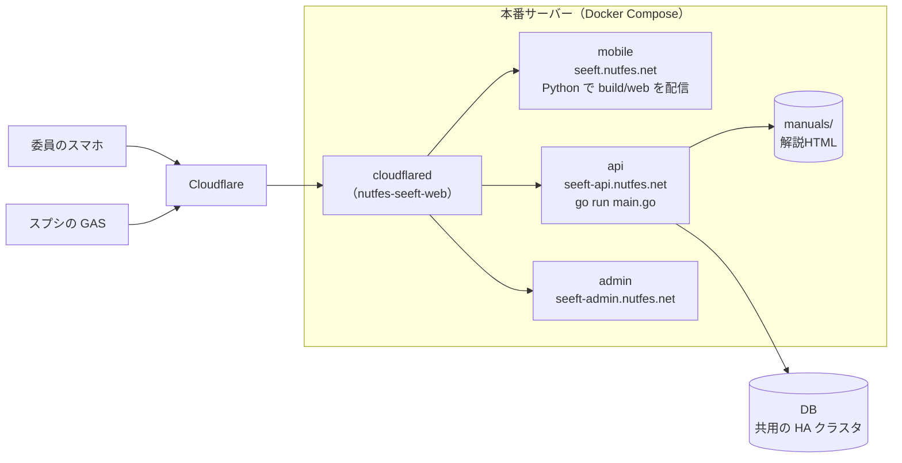

# 本番へのデプロイ

SeeFTの本番（API・アプリ・管理画面）にdevelopの変更を反映する手順である。45th（2026年）に実際に行った手順と、そのときにつまずいたところをもとに書いた。

デプロイには、期間中の更新と年度はじめの初期化の2種類がある。期間中の更新では、DBはそのままで、APIやアプリのコードだけを入れ替える。45thでは8/29〜9/20に何度も行った。年度はじめの初期化では、DBを作り直してから立ち上げる。年に1回、説明会（1日目の約3週間前）より前に行う。

本番サーバーへの入り方、作業ディレクトリ、DBの接続先は別紙（後任にだけ渡す）にある。

## 本番の構成



知っておくことが4つある。

1つ目に、ソースはイメージの中に含まれる。サーバーで`git pull`しただけでは何も変わらないので、`build`してから`up`する。

2つ目に、APIは起動のたびにコンパイルする。`api/prod.Dockerfile`はビルド時にコンパイルせず、composeの`go run main.go`が起動時にモジュールを取得してコンパイルする。そのため起動にはインターネット接続が要り、起動直後の数十秒〜数分はAPIが応答しない。

3つ目に、DBはサーバーの外にあり、本番のcomposeには含まれない。DBは他のサービスと共用のHAクラスタで、ボリュームを消して作り直すような操作はできない。アプリからの接続は、接続プール（PgBouncer）、Primaryを選んで振り分けるHAProxy、Postgresの順に通る。DDL用のポートは、接続プールを通らない（下の「migrateとseed」）。ポートとアドレスは別紙にある。

4つ目に、解説HTMLはサーバーの`manuals/`にしかない。gitの管理外なので、サーバーを作り直すと消える。DBを初期化しても消えない。

## 作業の前に

composeファイルの指定を忘れると、開発用の設定を読んでしまう。フォルダが同じなので`docker compose ps`の一覧は同じように見え、気づけない。最初に環境変数で固定し、DBのサービスが出てこないことを確かめる。

```bash
export COMPOSE_FILE=docker-compose.prod.yml
```

```bash
docker compose config --services
```

`api`・`mobile`・`admin`・`cloudflare`の4つだけが出ればよい。`db`が出たら、開発用の設定を読んでいる。

45thの本番サーバーには、開発用のcomposeから起動された`nutfes-seeft-db`というコンテナが残っていた。APIは使っていない。`up`のときに`--remove-orphans`を勧められても打たない。

## 期間中の更新（DB変更なし）

### 1. 何を入れ替えるかを決める

本番で動いているコミットとdevelopの差分を見て、入れ替える対象を決める。**「直近に自分がマージしたPR」ではなく、差分の全体で判断する**。45thでは「apiだけでよい」と伝えたのに、差分に別の人のmobileの変更が含まれていたことがあった。

```bash
git fetch origin && git log -1 --oneline
```

```bash
git diff --name-only HEAD..origin/develop
```

| 差分のあるディレクトリ | やること |
| --- | --- |
| `api/` | apiをbuildして入れ替える |
| `mobile/` | mobileをbuildして入れ替える |
| `admin/` | adminをbuildして入れ替える |
| `postgresql/` | この手順ではない。DBの変更を伴うので、中身を確かめてから別に計画する |
| `gas/` | コンテナとは関係ない。`clasp`で反映する（[gas/README.md](../../gas/README.md)） |

DBの変更があるか（`postgresql/`の行に当たるか）は、PRの最終版の差分で確かめる。ほかの人やAIのツールの「DBの変更は無い」という説明を、そのまま信じない。途中のコミットで足したファイルを、最後のコミットで消しているPRもある（45thの#546は、途中でテーブルを足すファイルを入れ、最後に消していた）。PRごとに、最終版で変わるファイルの一覧を見る。`gh pr view <番号> --json files`は100件までしか返さないので、ページを全部取る次の形で見る。

```bash
gh api --paginate repos/NUTFes/SeeFT/pulls/<PR の番号>/files --jq '.[].filename'
```

### 2. ディスクの空きを確かめる

```bash
df -h /
```

```bash
docker system df
```

| 空き | 判断 |
| --- | --- |
| 10GB以上 | そのままbuildしてよい |
| 6〜10GB | 先に掃除する（下の「古いイメージを消す」） |
| 6GB未満 | buildしない |

apiとmobileを1回buildすると約2.8GB減る（45thで実際に測った値）。

### 3. 今のイメージを退避する

戻せるように、入れ替えるサービスの今のイメージに別名を付けておく。**名前には日付ではなくコミットのハッシュを使う**。同じ日に2回デプロイすると、日付の名前は警告なしに上書きされる。

イメージの名前は、composeのプロジェクト名（何も指定しなければ作業ディレクトリの名前）から決まる。`docker-compose.prod.yml`には`image:`を書いていないので、ディレクトリの名前が変わるとイメージの名前も変わる。退避の前に、composeが実際に使う名前を確かめる。

```bash
docker compose config --images
```

45thの本番では`seeft-api`と`seeft-mobile`だった。以下の例はこの名前で書く。違う名前が出たら、そちらに読み替える。

```bash
docker tag seeft-api:latest seeft-api:before-<本番のコミット>
```

```bash
docker tag seeft-mobile:latest seeft-mobile:before-<本番のコミット>
```

### 4. 取り込んでbuildする

```bash
git pull --ff-only origin develop
```

手順1で決めた、入れ替えるサービスだけをbuildする。

```bash
docker compose build <入れ替えるサービス>
```

apiとmobileの両方を入れ替えるなら`docker compose build api mobile`になる。入れ替えないサービスまでbuildすると、時間とディスクを無駄に使う（mobileのbuildは数分かかり、容量も減る）。

buildのあいだは古いコンテナが動き続けるので、本番は止まらない。

### 5. apiを入れ替えるときは、入れ替えて確かめる

```bash
docker compose up -d api
```

**ログで判断しない**。APIはログに何も出さずにコンパイルするので、直後の`docker compose logs`には古いリクエストが並ぶだけで、起動メッセージが出ないことがある。コンテナを作り直すと、それ以前のログは消える。次の3つで確かめる。

- `docker compose ps api`のSTATUSが`Up`になっている
- `docker inspect --format '{{.Image}}' nutfes-seeft-api`が、いまbuildしたイメージのIDになっている
- コンテナの中のファイルに、今回の変更にしかない文字列がある

```bash
docker exec nutfes-seeft-api grep -c <今回の変更にしかない文字列> <変更したファイルのパス>
```

前回の修正が元に戻っていないことも、同じ方法で1つ確かめるとよい。

コンテナのログや`docker inspect`の時刻はUTCである。日本時間は9時間足す。

### 6. mobileを入れ替えるときは、入れ替えて確かめる

```bash
docker compose up -d mobile
```

`up`の出力でapiが`Running`と出ていれば（作り直されていなければ）、APIは止まっていない。

mobileの配信元はイメージの中の`build/web`である。composeの`./mobile:/app`のマウントは配信に使われていないので、buildを省くと反映されない。

確かめ方は2つある。

- `main.dart.js`の`Last-Modified`が、buildした時刻になっている
- `main.dart.js`に、今回の変更にしかない文字列がある。日本語は`\uXXXX`の形で埋め込まれているので、生の日本語では検索できない。英数字の識別子で探すか、エスケープした形で探す

**公開URLの応答は、Cloudflareに残った古いキャッシュのことがある**。配信サーバーは`Cache-Control`を返さず、Cloudflareは設定を変えなければJSファイルをキャッシュする。URLの末尾に毎回違うクエリを付けて、キャッシュを通さずに確かめる。応答の`cf-cache-status`が`HIT`でなければ、配信サーバーから直接来ている。

```bash
curl -sI "https://seeft.nutfes.net/main.dart.js?v=$(date +%s)" | grep -i "last-modified\|cf-cache-status"
```

同じ理由で、入れ替えた直後は、委員の端末にも古いアプリ本体が届くことがある。

`up`の直後は配信サーバーの準備ができておらず、空の応答が返ることがある。数秒待ってから確かめる。

### 7. スマホで確かめる

ログインして、自分のシフトカードと、今回変えたところを開く。

### 8. 古いイメージを消す

戻し先として残すのは、**本番で動作を確かめた1世代だけ**にする。順番は「今の版を退避する → 古い退避を消す」。逆にすると、一瞬だけ戻し先がなくなる。

```bash
docker images
```

```bash
docker rmi seeft-api:before-<古いコミット> seeft-mobile:before-<古いコミット>
```

`docker image prune -a`は退避したイメージも消すので打たない。名前の付いていないイメージだけを消すなら`docker image prune -f`（`-a`なし）を使う。

1〜2世代前のイメージを消しても、ほとんど空きは増えない。層を共有しているためである。空きが増えるのは数週間前の世代を消したときである。

### 戻すとき

退避した名前を`latest`に付け直して、buildせずに起動する。

```bash
docker tag seeft-api:before-<本番のコミット> seeft-api:latest
```

```bash
docker compose up -d --no-build api
```

mobileも同じである。退避より前の版に戻す必要があれば、gitからその版をbuildし直す（15分程度）。

### 止まっているあいだに起きること

apiを入れ替えると、起動するまでの数十秒〜数分、次のことができなくなる。

- ログイン
- シフトの取得（アプリは前回取得した分を表示する）
- レスキューの送信
- 解説HTMLの表示
- スプシのGASからの送信

技大祭の期間中に入れ替えるときは、人が少ない時間帯を選ぶ。45thは技大祭2日目の開催中にも入れ替えたが、止まったのは20〜30秒だった。

mobileの入れ替えは数秒で済む。ただし入れ替えた直後は、全員がアプリの本体とフォント（約6MB）を取り直す。

### GASとまたがる変更の順番

1つの変更がAPIとGASの両方にまたがるときは、「古い側が新しい側を受け取っても害がない」順に出す。

45thのレスキュー通知（#546）は、GAS → APIの順にした。今のAPIは知らない項目を無視するので、新しいGASが先でも害はない。逆にすると、通知してはいけない送信者にDMが飛ぶ。

45thの休憩カード（#492）は、API → mobile → GAS → シフトの送り直しの順にした。休憩のデータが入るのはGASを更新して送り直したときなので、それまではAPIとmobileを戻しても害がない。逆にGASを先に入れて送り直すと、休憩の担当者を隠す処理が入っていない古いAPIのまま、休憩のシフトが入る。休憩のカードに担当者として全員が並び、誰が休憩中かが全員に見える（PR #492の本文）。一度見られたものは、あとからAPIを入れ替えても取り消せない。

### 環境変数だけを変えるとき

`api/env/seeft.env`を書き換えただけでは、コンテナが作り直されないことがある。明示的に作り直す。

```bash
docker compose up -d --force-recreate --no-build api
```

## 年度はじめの初期化（DBを作り直す）

45thは8/27〜8/28に、次の順で行った。サーバーの担当者に手順を渡し、値は別経路で渡した。

1. 現状（ブランチ、コミット、`api/env/seeft.env`と`mobile/env/.env`にある変数の名前）を確かめる
2. developを取り込む
3. `api/env/seeft.env`に足りない変数を足す。すでにある値は上書きしない（下の「環境変数」）
4. `mobile/env/.env`を今年の値（日付・委員長・操作説明のURLなど）にする。コンパイル時にアプリに埋め込まれるので、buildの前に済ませる
5. apiとmobileをbuildする
6. apiを止め、DBのスキーマを作り直し、migrateとseedを流す
7. apiとmobileを起動して、ログを確かめる

起動したあと、SeeFT側で次を行う。

1. シフトスプシのスクリプトプロパティ`API_BASE_URL`を本番に切り替える（忘れると、全員分が検証環境に送られる）
2. 名簿 → タスク → シフトの順に送る（[SeeFTに渡すデータの約束事](seeft-data-contract.md)）
3. ログインして、シフトカードが出ることを確かめる

### 初期化の前に確かめること

- `postgresql/db/seed.sql`とAPIのコードに、前年の年度と日付が書かれている。直すところは[SeeFTに渡すデータの約束事](seeft-data-contract.md)の「年度が変わるときに直すところ」にある。
- 前年のデータを残すなら、先に取り出す。スキーマを作り直すと全部消える（アプリ内レビューなど）。
- `USER_DEFAULT_PASSWORD`を先に設定する。初期パスワードは、名簿送信でユーザーが作られた時点の値で固定される。
- `SLACK_BOT_TOKEN`を入れる順番に気をつける。順番を間違えると、溜まったシフト変更が一斉にDMで飛ぶ（[SeeFTに渡すデータの約束事](seeft-data-contract.md)の「Slack通知を有効にする順番」）。
- `shifts`のインデックスを貼り直す。migrationに入っていないので、作り直すと消える（issue #500）。インデックスを作るDDL（`CREATE INDEX CONCURRENTLY`）も、migrateと同じくDDL用のポートで打つ（下の「migrateとseed」）。アプリ用のポート（接続プール経由）では、トランザクションの中として扱われて失敗する（2026-09-10に本番のDBで確かめた）。どちらのポートにつながっているかは、psqlの`\conninfo`で確かめる。SQLの`inet_server_port()`はPostgres本体のポートを返すので、見分けられない。

### migrateとseed

migrateは`postgresql/db/schema/`の`create*.sql`を番号順に流し、続けて`postgresql/db/migrations/`を当てる。APIの起動時にはmigrateは走らない。

DDLは、接続プールを迂回するDDL用のポートで流す。これはDB基盤の決まりである。migrateは`NUTMEG_DB_PORT`のポートに接続するが、`seeft.env`のこの値はアプリ用の接続プール経由のポートを指している。そのためmigrateのときだけ、`-e`でDDL用のポートに上書きする。ポートの値は別紙にある。値が変わっていないかは、流す前にDB基盤の担当者に確かめる。

流す前に、上書きが反映されていることを確かめる。

```bash
docker compose run --rm --no-deps -e NUTMEG_DB_PORT=<DDL用のポート> api printenv NUTMEG_DB_PORT
```

```bash
docker compose run --rm --no-deps -e NUTMEG_DB_PORT=<DDL用のポート> api go run ./cmd/migrate
```

Makefileの`prod-migrate`はポートを上書きしないので、そのままでは使わない。

seedはデータの投入なので、アプリ用のポートのままでよい。

```bash
docker compose run --rm --no-deps api go run ./cmd/seed
```

## 環境変数

値はここに書かない。どこに入っているかは別紙にある。

### API（`api/env/seeft.env`、サーバーの上にだけある）

| 変数 | 使い道 |
| --- | --- |
| `NUTMEG_DB_HOST` `NUTMEG_DB_PORT` `NUTMEG_DB_NAME` `NUTMEG_DB_USER` `NUTMEG_DB_PASSWORD` | DBの接続先。SSLはcomposeで`NUTMEG_DB_SSLMODE=require`に固定している |
| `USER_DEFAULT_PASSWORD` | 名簿送信で作るユーザーの初期パスワード |
| `SLACK_BOT_TOKEN` | シフト変更・レスキュー対応状況のDM。未設定ならDMの仕組みごと止まる（APIは起動する） |
| `SLACK_CHANNEL_ID` | 使っていない（チャンネルへの送信は無効） |
| `RESCUE_GAS_URL` | レスキューの転記先（GASのウェブアプリ）。知っていれば誰でもスプシに書き込めるので秘密として扱う |
| `RESCUE_NOTIFICATION_DISABLED` | `true`にするとレスキュー対応状況のDMだけを止める |
| `MANUAL_OAUTH_CLIENT_ID` `MANUAL_OAUTH_CLIENT_SECRET` `MANUAL_OAUTH_REDIRECT_URL` | 解説HTMLを技大祭アカウントだけに見せるためのGoogleログイン |
| `MANUAL_UPLOAD_TOKEN` | 解説HTMLのアップロード用。未設定ならアップロードだけが無効になる |
| `MANUAL_DIR` | 解説HTMLの置き場所。未設定なら`/manuals`（composeがホストの`manuals/`をここにマウントする） |

### アプリ（`mobile/env/.env`、buildのときに埋め込まれる）

**書き換えたらmobileをbuildし直すまで反映されない**。毎年変わるものが多い。

| 変数 | 使い道 |
| --- | --- |
| `API_BASE_URL` | APIのURL。末尾にスラッシュを付けない（付けると全部の通信が404になり、ログイン画面には「学籍番号もしくはパスワードが違います」と出る） |
| `NUTFES_PREPARATION_DAY` `NUTFES_DAY1` `NUTFES_DAY2` `NUTFES_TIDYING_UP_DAY` | 技大祭の日付。シフトの終了時刻の計算に使う。過去の日付のままだと、レビューを求める画面がシフトカードを覆う |
| `CHAIRPERSON_NAME` `CHAIRPERSON_PHONE_NUMBER` | 委員長の名前と電話番号 |
| `SEEFT_INSTRUCTIONS_URL` | アプリの「操作説明」で開く資料 |
| `WHOLE_SHIFT_URL` | 全体シフトの資料 |

## 止まったときの復旧

### 何が落ちているかを見分ける

ブラウザで`https://seeft-api.nutfes.net`を開いたときのCloudflareのエラーで、見当を付けられる。

| 表示 | 意味 |
| --- | --- |
| 1033 | Cloudflareが、つながっているトンネル（cloudflared）を見つけられない。cloudflaredのコンテナだけが落ちている場合も、サーバーごと止まっている場合もある |
| 502 | トンネルはつながっているが、その先のAPIに届かない。APIが落ちている場合と、cloudflaredからAPIへつながらない場合がある |

エラー番号だけで落ちた場所を決めつけない。サーバーに入れるなら、コンテナの状態とログで確かめる。サーバーに入れないなら、サーバーそのもの（またはその下の物理ノード）が止まっている。

```bash
docker compose ps
```

```bash
docker compose logs --tail 50 cloudflare
```

```bash
docker compose logs --tail 50 api
```

アプリ・API・管理画面の3つが同時に落ちるのは、1本のトンネルを共有しているからである。全部のコンテナが同時に`Exited (255)`になっていたら、アプリの不具合ではなく、外側（サーバーやその下の物理ノード）が止まった印である。

### 自動では戻らない

45thの本番は、物理ノードが止まって復帰しても、自動では立ち上がらない設定だった（2026-09-15に約3時間止まった）。コンテナを載せている環境の自動起動も、composeの`restart:`も設定されていない。復旧は手作業で、次の順に行う。

1. 物理ノードとコンテナを載せている環境を起動する（別紙）
2. apiを先に起こし、ログに`http server started`が出るのを確かめる
3. mobile・admin・cloudflareを起こす

`nutfes-seeft-db`の`Exited`は正常である。本番は外のDBを使っているので、起こさない。

恒久対策は2つある。コンテナを載せている環境の自動起動を有効にすることと、`docker-compose.prod.yml`の4サービスに`restart: unless-stopped`を付けることである。どちらも未実施。
