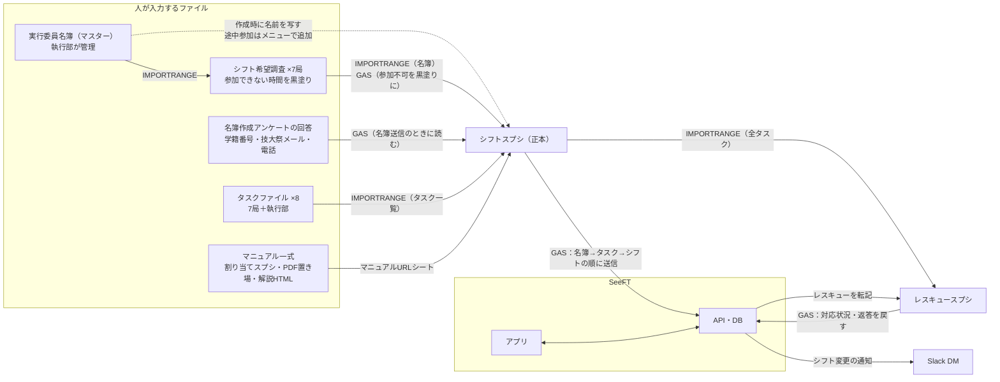
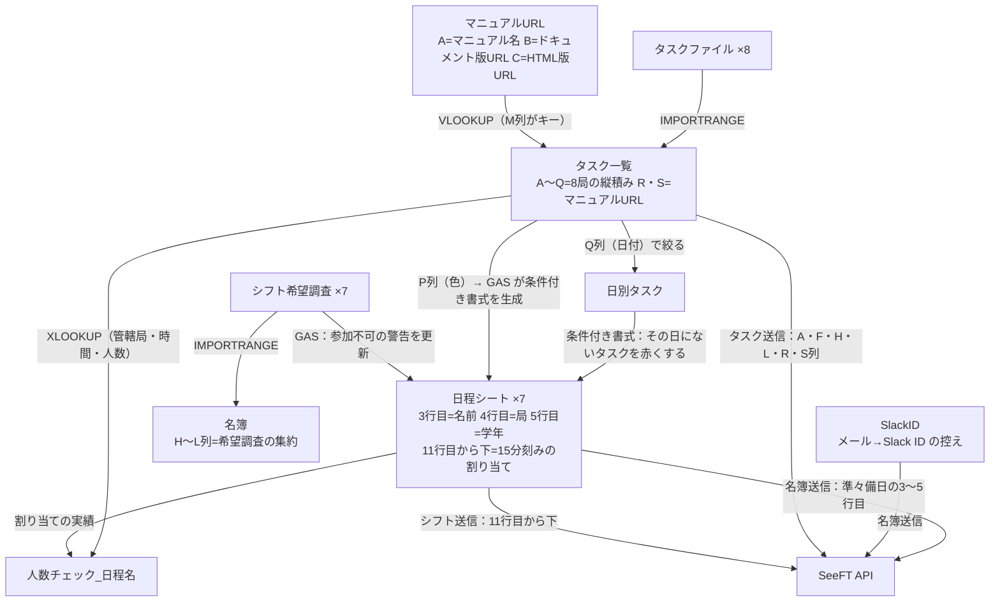
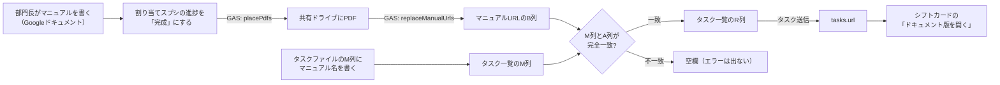
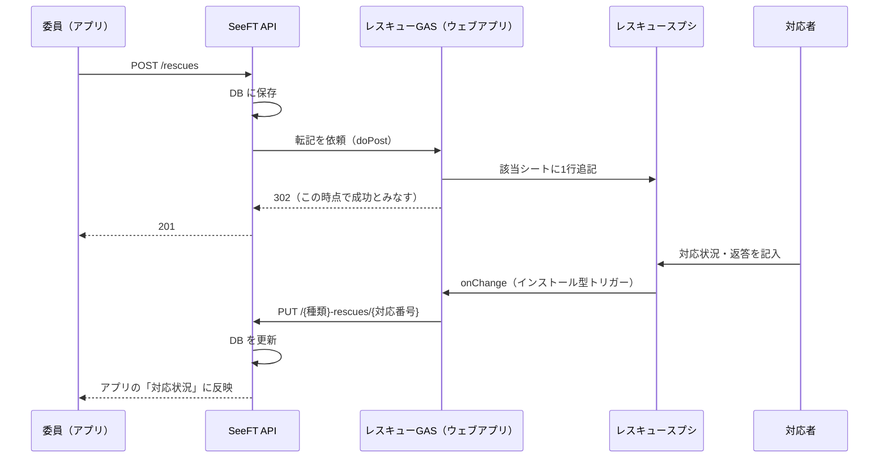

# スプレッドシートの依存関係

45th（2026年）の技大祭で、シフト・タスク・名簿・マニュアル・レスキューを扱ったスプレッドシートと Apps Script（GAS）の構成を記録したものである。46th でスプレッドシートを作り直すときに、**何を先に作るか**と、**どこからどこへデータが流れるか**を把握するために使う。

45th の構成をそのまま再現する必要はない。ただし SeeFT に渡すデータの形は守る必要があり、それは [SeeFT に渡すデータの約束事](seeft-data-contract.md) に書いた。スプレッドシートの ID・所有者・共有範囲は公開リポジトリに置かず、別紙（技大祭の共有ドライブ）に置く。

この文書は 2026-09-21 時点の記録（ライブの GAS を `clasp` で取得したもの、本番 API の実測、作業記録）から書いた。「要確認」と書いた箇所は記録から確定できなかったものである。

## 全体図（ファイル単位）

実線は数式や GAS で自動的に流れるもの、点線は人の手で写すものである。

マニュアル一式の中の流れは、後の「マニュアルがアプリに届くまで」に分けて描いた。

読み取れることは3つある。

- **シフトスプシがすべての合流点になっている。** 名簿・タスク・参加可否・マニュアルURLがここに集まり、SeeFT への送信もここからしか行わない。
- **上流は4系統あり、作る人が別々である。** 名簿は執行部、タスクファイルと希望調査は各局、マニュアルは部門長と SeeFT が作る。どれか1つが遅れると、シフトスプシでの作業が止まる。
- **マスター名簿からシフトスプシへの線だけが手作業である。** 希望調査は数式で名簿に追従するが、シフトスプシの日程シートにある名前は作成時点の写しである。途中から参加した人は、SeeFT メニューの「メンバーを追加」で足す必要がある（[人手でやった作業](calendar-and-manual-work.md)）。

## 作る順番

矢印の向きに従うと、作る順番は次のとおりになる。上流のファイルができていないと、下流の数式は `#REF!` や `#N/A` を返すだけである。

1. **実行委員名簿（マスター）**：執行部が作る。最初から「固定名簿」シートを用意し、局別シートはそこを参照させる（理由は後述の「45th で踏んだ設計上の弱点」）。
2. **名簿作成アンケート**：学籍番号（8桁）・技大祭メール・電話番号を集める。SeeFT のログインと Slack 通知は、この3つがないと動かない。
3. **タスクファイル ×8**：列の並び（A〜Q）を全局でそろえる。シフトスプシが8ファイルをまとめて縦に積むので、1局でも列がずれると全体が崩れる。
4. **シフト希望調査 ×7**：名簿の列はマスターからの IMPORTRANGE で作る。
5. **シフトスプシ**：上の4つを参照する。GAS、スクリプトプロパティ、トリガーもこの時点で設定する。
6. **マニュアル割り当て**：3〜5と並行して作ってよい。PDF の置き場フォルダもあわせて作る。
7. **レスキュースプシ**：シフトスプシのタスク一覧を参照する。技大祭の数週間前でよい（45th は8/25に作成）。

## ファイルごとの役割

| ファイル | 作る人・書く人 | 中身 | 読む側 |
| --- | --- | --- | --- |
| 実行委員名簿（マスター） | 執行部 | 全体名簿（実データ）、固定名簿、局別シート7枚 | 希望調査の名簿列 |
| 名簿作成アンケートの回答 | 委員本人（フォームで回答） | C列=学籍番号、D列=氏名、F列=技大祭メール、I列=課程、L列=電話番号 | シフトスプシの GAS（名簿送信） |
| シフト希望調査 ×7 | 各局の委員本人 | 名簿、日程別5シート（15分刻みで参加できない時間を黒塗り） | シフトスプシの名簿シート、GAS（参加不可の警告） |
| タスクファイル ×8 | 各局（部門長） | `45th_task` シートの A〜Q 列（総務局だけ `45th_task_1`） | シフトスプシのタスク一覧 |
| シフトスプシ | SeeFT と執行部が構成を作り、シフトは執行部が割り当てる | 下の「シフトスプシの中」 | SeeFT API、レスキュースプシ |
| マニュアル割り当て | 執行部が管理し、部門長が進捗を書く | マニュアル名（ドキュメントへのリンク）、担当局、進捗、PDF配置（AB列） | GAS（PDF配置・URL差し替え） |
| レスキュースプシ | SeeFT が作り、当日は対応者が記入する | 質問・トラブル・人が来ない・事件事故、全タスク | SeeFT API（対応状況・返答） |

各局のタスクファイルには前年の `44th_task` シートが残っている。IMPORTRANGE が読むのはシート名で指定した `45th_task` だけなので、残っていても害はない。ただし URL の gid で開くと 44th 側を見てしまうことがあり、「45th に反映されない」と誤解する原因になった。

## シフトスプシの中（シート単位）

### タスク一覧

`タスク一覧!A4` の1本の数式（LET と IMPORTRANGE ×8）が、8つのタスクファイルを縦に積んでいる。3行目が見出し、4行目からがデータである。

| 列 | 見出し | 使い道 |
| --- | --- | --- |
| A | シフト名 | タスク名。シフト送信のタスク名と完全一致で結びつく |
| B | 天気 | |
| C / D | 開始時間 / 終了時間 | 人数チェック |
| E | 拘束時間 | 表示形式 `[h]:mm`。数式を貼り直すと消える |
| F | 管轄局 | タスク送信 |
| G | レベル | 人数チェック |
| H | 集合場所 | タスク送信。空だと「本部」になる |
| I | 作業場所 | |
| J / K / L | 最低 / 適性 / 最大人数 | 人数チェック。L はタスク送信にも使う |
| M | リンク | **見出しは「リンク」だが、中身はマニュアル名の文字列**。マニュアルURLシートとの結合キー |
| N / O | タスク内容 / 備考 | |
| P | 色 | 日程シートの色分け |
| Q | 日付 | 準々備日 / 準備日 / 1日目 / 2日目 / 片付け日。複数日はカンマ区切り |
| R | ドキュメント版URL | `VLOOKUP(M列, マニュアルURL, 2)`。アプリの「ドキュメント版を開く」 |
| S | HTML版URL | `VLOOKUP(M列, マニュアルURL, 3)`。アプリの解説スライド |

A〜Q は IMPORTRANGE の出力なので、**タスク一覧のセルを直接編集してはいけない**。編集すると配列が壊れ、全局のタスクが消える。直すときは該当する局のタスクファイルを直す（どの局かは F 列で分かる）。

### 日程シート

`準々備日`、`準備日`、`1日目_晴れ`、`1日目_雨`、`2日目_晴れ`、`2日目_雨`、`片付け日` の7枚ある。44th までと違い、**名前が列、時刻が行**に並ぶ。

- 3行目に名前、4行目に局、5行目に学年が入る。名簿送信は `準々備日` シートのこの3行を読む（名簿シートではない）。
- 11行目から下の A 列に時刻（6:00 から15分刻みで64コマ）が入り、その右が割り当てのグリッドである。
- セルの値がタスク名になる。**背景が黒（`#000000`）のセルは「参加不可」**として送られる。
- 色分けは「タスク名に完全一致したら P 列の色」という条件付き書式で、GAS が作る。作った時点のタスクしか色が付かないので、タスクを追加したら「条件付き書式を設定する」を実行し直す。

45th では雨の日程シートを送信しておらず、アプリも晴れのシフトしか表示しない。

### 名簿シート

A 列から名前などが並び、H〜L 列は7局の希望調査を LET・VSTACK・XLOOKUP で集約した数式である。シートは保護されており、編集すると「実行してもよろしいですか？」の確認が出る。OK を押すまで編集は確定しない。

### そのほかのシート

- **マニュアルURL**：A 列にマニュアル名、B 列にドキュメント版（45th の後半からは PDF）の URL、C 列に HTML 版の URL を入れる。A 列はタスク一覧の M 列からコピーして作る（手で打つと、末尾の空白や全角・半角の違いで一致しなくなる）。
- **日別タスク**：タスク一覧の Q 列から、日程ごとのタスク名を FILTER で並べる。日付外タスクの警告に使う。
- **人数チェック_日程名**：GAS が作る。行がタスク、列が15分刻みのマトリクスで、最低・最大人数との過不足を表示する。
- **SlackID**：名簿送信のときに Slack で引いたユーザーIDの控え。引けなかった人は手で行を足す。

### シフト希望調査（各局1ファイル）

シートは「記入法」「名簿」と日程別の5枚（準々備日〜片付け日）である。左の A〜F 列（名前・局・部門・備考・学年・課程）はマスター名簿からの参照で編集できず、G 列から右が15分刻みの記入欄になる。参加できない時間帯は、**セルを黒く塗り、理由（授業・研究など）を書く**。

名簿シートと日程別シートの行は、**行番号で暗黙に対応している**。これが 45th の行ズレ事故の原因になった（[事故の記録](incidents-45th.md)）。

## マニュアルがアプリに届くまで

結びつきは**マニュアル名の完全一致**だけで成り立っている。末尾の空白、拡張子（`.docx`）、`45th_` の有無が1文字違うだけで、エラーも出さずに空欄になる。送信前に、SeeFT メニューの「【事前確認】マニュアルURLの紐付けを点検する」で確かめる。

B 列を差し替えても、**タスク送信をするまでアプリには届かない**。45th ではこの手順が Slack の案内から抜けていた。

HTML 版の作り方は [解説マニュアルHTML 運用手順](../development/manual-html-operations.md) にある。

## レスキューの往復

- 対応状況と返答の列はシートごとに違う。質問は I・J 列、トラブルと人が来ないは K・L 列である。各シートの1行目にある「↓ここを記入」が目印になる。
- ウェブアプリは**バージョン固定**でデプロイされている。`clasp push` だけでは本番の挙動は変わらない。同じデプロイIDに新しいバージョンを割り当てる必要がある（`clasp deploy -i <デプロイID>`）。新しくデプロイすると URL が変わり、サーバーの設定（`RESCUE_GAS_URL`）が古いコードを指したままになる。
- 全タスクシートは、シフトスプシのタスク一覧を IMPORTRANGE で取り込んでいる。用途（対応者が何に使うか）は要確認。

## コピーしても引き継がれないもの

45th は、前年や試作のスプシを「コピーを作成」して作った。見た目はそのまま複製されるが、次のものは複製されない。コピーのたびに設定し直す必要がある。

| 引き継がれないもの | 単位 | 症状 | 対処 |
| --- | --- | --- | --- |
| IMPORTRANGE の接続許可 | 取り込み先と取り込み元のファイルの組 | 全行が `#N/A` になる | 空いたセルに素の `=IMPORTRANGE(URL, "A1")` を置き、「アクセスを許可」を押してから消す。LET の中の IMPORTRANGE には許可ボタンが出ない |
| GAS の実行承認（OAuth） | 利用者とスクリプトの組 | 初回実行で承認画面が出る。Chrome に複数アカウントでログインしていると `access_denied` になる | 技大祭アカウントを選んで承認する。承認後、元の関数は自動では走らないのでもう一度実行する |
| インストール型トリガー（`onChange`、`onSelectorEdit`） | スクリプト | 編集しても何も起きない | Apps Script の「トリガー」画面で設置する。**設置は1人だけ**（複数人が設置すると1回の編集で複数回走る） |
| ウェブアプリのデプロイ | スクリプト | 新しい URL になる | デプロイして、URL をサーバーの設定に入れる |
| スクリプトプロパティ | スクリプト | 要確認 | `API_BASE_URL`・`YEAR_ID`・`SLACK_BOT_TOKEN` が入っているかを確認する |

Chrome に複数の Google アカウントでログインしていると、「拡張機能 → Apps Script」が別のアカウント側で開き、「現在、ファイルを開くことができません」と表示される。権限不足に見えるが、共有設定の問題ではない。技大祭アカウントを既定にするか、`script.google.com/u/1/` のようにアカウント番号を指定して開く。

## 45th で踏んだ設計上の弱点

46th で作り直すときに、同じ形を採るかどうかを判断する材料として残す。

- **行番号で暗黙に対応させている。** 希望調査の名簿シートと日程別シートは、行番号でしか結びついていない。マスター名簿の並べ替えが IMPORTRANGE 経由で名簿側だけに伝わり、手で塗った黒塗りがずれた。変更履歴にも残らない。45th はマスターに固定名簿を作り、局別シートをそこから引くことで対処した。
- **参加不可を背景色で表している。** 値ではないので、gviz など値しか読まない方法では見えない。GAS は背景色を読んで判定している。
- **マニュアル名の完全一致に依存している。** 上の「マニュアルがアプリに届くまで」のとおり。ファイル名を変えると、IMPORTRANGE を通してM列の値も変わり、一致が静かに外れる。
- **同じ名前のタスクは1つにまとめられる。** タスク送信は同名を先勝ちで1件にする。1日目と2日目で同じ名前の開店・閉店チェックは、2日目のマニュアルが捨てられ、1日目のものが開いた。日によって中身が違うなら、タスク名を分ける。
- **総務局だけシート名が `45th_task_1`。** 名前を統一しようとして `45th_task` に直すと、総務局の取り込みが `#REF!` になる。
- **IMPORTRANGE の縦積みは1本欠けると全体が消える。** 読み込み途中の1局が空になると配列の列数がそろわず、タスク一覧全体が `#VALUE!` になる。45th は各 IMPORTRANGE を IFERROR で包んで、その局だけが一時的に欠ける形にした。
- **名前の表記ゆれ。** 「伊藤」と「伊東」、姓名のあいだの空白の有無など。SeeFT は名前の完全一致で人を特定する。
