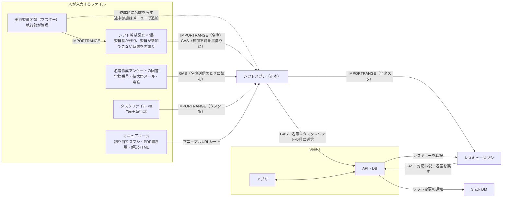
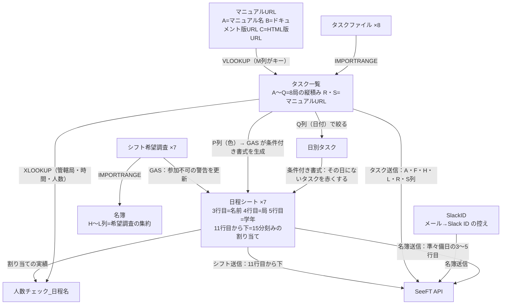
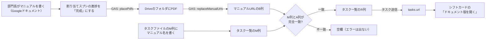
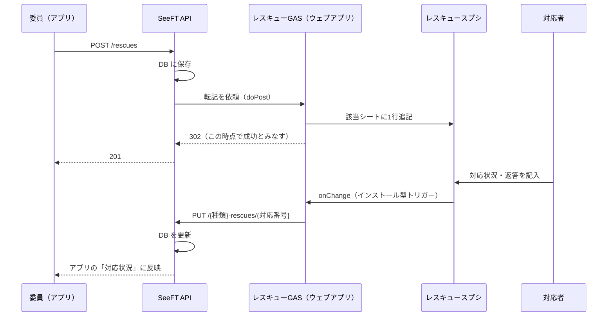

# スプレッドシートの依存関係

45th（2026年）の技大祭で、シフト・タスク・名簿・マニュアル・レスキューを扱ったスプレッドシートとApps Script（GAS）の構成を記録したものである。46thでスプレッドシートを作り直すときに、何を先に作るかと、どこからどこへデータが流れるかを把握するために使う。

45thの構成をそのまま再現する必要はない。ただし、SeeFTに渡すデータの形は守る必要がある。その形は[SeeFTに渡すデータの約束事](seeft-data-contract.md)に書いた。スプレッドシートのID・所有者・共有範囲は公開リポジトリに置かず、後任にだけ渡す別紙に置く。

この文書は2026-09-21時点の記録（ライブのGASを`clasp`で取得したもの、本番APIで実際に測った値、作業記録）から書いた。「要確認」と書いた箇所は記録から確定できなかったものである。

## 全体図（ファイル単位）

実線は数式やGASで自動的に流れるもの、点線は人の手で写すものである。

```mermaid
flowchart LR
  subgraph IN["人が入力するファイル"]
    direction TB
    MASTER["実行委員名簿（マスター）<br/>執行部が管理"]
    SURVEY["シフト希望調査 ×7局<br/>委員長が作り、委員が参加できない時間を黒塗り"]
    FORM["名簿作成アンケートの回答<br/>学籍番号・技大祭メール・電話"]
    TASKF["タスクファイル ×8<br/>7局＋執行部"]
    MANUAL["マニュアル一式<br/>割り当てスプシ・PDF置き場・解説HTML"]
  end

  SHIFT["シフトスプシ（正本）"]
  RESCUE["レスキュースプシ"]

  subgraph SEEFT["SeeFT"]
    direction TB
    API["API・DB"]
    APP["アプリ"]
  end

  SLACK["Slack DM"]

  MASTER -- "IMPORTRANGE" --> SURVEY
  MASTER -. "作成時に名前を写す<br/>途中参加はメニューで追加" .-> SHIFT
  SURVEY -- "IMPORTRANGE（名簿）<br/>GAS（参加不可を黒塗りに）" --> SHIFT
  FORM -- "GAS（名簿送信のときに読む）" --> SHIFT
  TASKF -- "IMPORTRANGE（タスク一覧）" --> SHIFT
  MANUAL -- "マニュアルURLシート" --> SHIFT
  SHIFT -- "GAS：名簿→タスク→シフトの順に送信" --> API
  SHIFT -- "IMPORTRANGE（全タスク）" --> RESCUE
  API -- "レスキューを転記" --> RESCUE
  RESCUE -- "GAS：対応状況・返答を戻す" --> API
  APP <--> API
  API -- "シフト変更の通知" --> SLACK
```

マニュアル一式の中の流れは、後の「マニュアルがアプリに届くまで」に分けて描いた。

読み取れることは3つある。

1つ目に、名簿・タスク・参加可否・マニュアルURLはすべてシフトスプシに集まり、SeeFTへの送信もシフトスプシからしか行わない。

2つ目に、上流は4系統あり、作る人が別々である。名簿は執行部が作る。希望調査は委員長が作り、委員本人が書く。タスクファイルは部門長が書き、マニュアルは部門長とSeeFTが作る。どれか1つが遅れると、シフトスプシでの作業が止まる。44thの引き継ぎ資料では、スプシの外にある当日のタイムスケジュール（企画局）と物品移動計画書（総務局）も、シフトを組むときの前提とされている。

3つ目に、マスター名簿からシフトスプシへの線だけが手作業である。希望調査は数式で名簿の変更に合わせて変わるが、シフトスプシの日程シートにある名前は作成時点の写しである。途中から参加した人は、SeeFTメニューの「メンバーを追加」で足す必要がある（[人手でやった作業](calendar-and-manual-work.md)）。

## 作る順番

矢印の向きに従うと、作る順番は次のとおりになる。上流のファイルができていないと、下流の数式は`#REF!`や`#N/A`を返すだけである。

1. 実行委員名簿（マスター）は、執行部が作る。最初から「固定名簿」シートを用意し、局別シートは固定名簿を参照させる（理由は後述の「45thで問題になった設計上の弱点」）。
2. 名簿作成アンケートで、学籍番号（8桁）・技大祭メール・電話番号を集める。SeeFTのログインとSlack通知は、この3つがないと動かない。
3. タスクファイル ×8は、列の並び（A〜Q）を全局でそろえる。シフトスプシが8ファイルをまとめて縦に積むので、1局でも列の数が違うとタスク一覧全体が`#VALUE!`になる。列の数が同じでも並びが違うと、その局の値がほかの局と違う列に入る。
4. シフト希望調査 ×7の名簿の列は、マスターからのIMPORTRANGEで作る。
5. シフトスプシは、上の4つを参照する。GAS、スクリプトプロパティ、トリガーもこの時点で設定する。
6. マニュアル割り当ては、3〜5と並行して作ってよい。PDFの置き場フォルダもあわせて作る。
7. レスキュースプシは、シフトスプシのタスク一覧を参照する。技大祭の数週間前でよい（45thは8/25に作成）。

## ファイルごとの役割

| ファイル | 作る人・書く人 | 中身 | 読む側 |
| --- | --- | --- | --- |
| 実行委員名簿（マスター） | 執行部 | 全体名簿（実データ）、固定名簿、局別シート7枚 | 希望調査の名簿列 |
| 名簿作成アンケートの回答 | 委員本人（フォームで回答） | C列=学籍番号、D列=氏名、F列=技大祭メール、I列=課程、L列=電話番号 | シフトスプシのGAS（名簿送信） |
| シフト希望調査 ×7 | 委員長が作り（局ごとに1ファイル）、各局の委員本人が書く（局長が記入を促す） | 名簿、日程別5シート（15分刻みで参加できない時間を黒塗り） | シフトスプシの名簿シート、GAS（参加不可の警告） |
| タスクファイル ×8 | 各局（部門長） | `45th_task`シートのA〜Q列（総務局だけ`45th_task_1`） | シフトスプシのタスク一覧 |
| シフトスプシ | SeeFTと執行部が構成を作り、シフトは執行部（委員長と副委員長の2人）が割り当てる | 下の「シフトスプシの中」 | SeeFT API、レスキュースプシ |
| マニュアル割り当て | 執行部（副委員長）が作り、情報局長が添削と催促に使い、部門長が進捗を書く | マニュアル名（ドキュメントへのリンク）、担当局、進捗、PDF配置（AB列） | GAS（PDF配置・URL差し替え） |
| レスキュースプシ | SeeFTが作り、当日は対応者が記入する | 質問・トラブル・人が来ない・事件事故、全タスク | SeeFT API（対応状況・返答） |

各局のタスクファイルには前年の`44th_task`シートが残っている。IMPORTRANGEが読むのはシート名で指定した`45th_task`だけなので、残っていても害はない。ただしURLのgidで開くと44th側を見てしまうことがあり、「45thに反映されない」と誤解する原因になった。

## シフトスプシの中（シート単位）

```mermaid
flowchart TB
  TASKF["タスクファイル ×8"] -- "IMPORTRANGE" --> TL
  MU["マニュアルURL<br/>A=マニュアル名 B=ドキュメント版URL C=HTML版URL"] -- "VLOOKUP（M列がキー）" --> TL
  TL["タスク一覧<br/>A〜Q=8局の縦積み R・S=マニュアルURL"]
  TL -- "Q列（日付）で絞る" --> DT["日別タスク"]
  DT -- "条件付き書式：その日にないタスクを赤くする" --> DAY
  TL -- "P列（色）→ GAS が条件付き書式を生成" --> DAY
  SURVEY["シフト希望調査 ×7"] -- "IMPORTRANGE" --> ROSTER["名簿<br/>H〜L列=希望調査の集約"]
  SURVEY -- "GAS：参加不可の警告を更新" --> DAY
  DAY["日程シート ×7<br/>3行目=名前 4行目=局 5行目=学年<br/>11行目から下=15分刻みの割り当て"]
  TL -- "XLOOKUP（管轄局・時間・人数）" --> CHK["人数チェック_日程名"]
  DAY -- "割り当ての実績" --> CHK
  SLACKID["SlackID<br/>メール→Slack ID の控え"]
  DAY -- "名簿送信：準々備日の3〜5行目" --> API["SeeFT API"]
  SLACKID -- "名簿送信" --> API
  TL -- "タスク送信：A・F・H・L・R・S列" --> API
  DAY -- "シフト送信：11行目から下" --> API
```

### タスク一覧

`タスク一覧!A4`の1本の数式（LETとIMPORTRANGE ×8）が、8つのタスクファイルを縦に積んでいる。3行目が見出し、4行目からがデータである。

| 列 | 見出し | 使い道 |
| --- | --- | --- |
| A | シフト名 | タスク名。シフト送信のタスク名と完全一致で結びつく |
| B | 天気 | |
| C / D | 開始時間/終了時間 | 人数チェック |
| E | 拘束時間 | 表示形式`[h]:mm`。数式を貼り直すと消える |
| F | 管轄局 | タスク送信 |
| G | レベル | 人数チェック |
| H | 集合場所 | タスク送信。空だと「本部」になる |
| I | 作業場所 | |
| J / K / L | 最低/適性/最大人数 | 人数チェック。Lはタスク送信にも使う |
| M | リンク | **見出しは「リンク」だが、中身はマニュアル名の文字列**。マニュアルURLシートとの結合キー |
| N / O | タスク内容/備考 | |
| P | 色 | 日程シートの色分け |
| Q | 日付 | 準々備日/準備日/1日目/2日目/片付け日。複数日はカンマ区切り |
| R | ドキュメント版URL | `VLOOKUP(M列, マニュアルURL, 2)`。アプリの「ドキュメント版を開く」 |
| S | HTML版URL | `VLOOKUP(M列, マニュアルURL, 3)`。アプリの解説スライド |

A〜QはIMPORTRANGEの出力なので、**タスク一覧のセルを直接編集してはいけない**。編集すると、IMPORTRANGEの結果を広げる先に値が入るので数式が`#REF!`を返し、全局のタスクが消える。直すときは該当する局のタスクファイルを直す（どの局かはF列で分かる）。

### 日程シート

`準々備日`、`準備日`、`1日目_晴れ`、`1日目_雨`、`2日目_晴れ`、`2日目_雨`、`片付け日`の7枚ある。44thまでと違い、名前が列、時刻が行に並ぶ。

3行目に名前、4行目に局、5行目に学年が入る。名簿送信は`準々備日`シートのこの3行を読む（名簿シートではない）。11行目から下のA列に時刻（6:00から15分刻みで64コマ）が入り、その右が割り当てのグリッドである。

グリッドのセルの値がタスク名になる。背景が黒（`#000000`）のセルは「参加不可」として送られる。セルには、タスク名のほかに参加できない理由のメモ（`研究`・`実務`・`体調不良`など）も入る。メモはタスク一覧にない名前なので、そのまま送ると別のタスクとしてDBにできる。

色分けは「タスク名に完全一致したらP列の色」という条件付き書式で、GASが作る。作った時点のタスクしか色が付かないので、タスクを追加したら「条件付き書式を設定する」を実行し直す。

45thでは雨の日程シートを送信しておらず、アプリも晴れのシフトしか表示しない。

### 名簿シート

A列から名前などが並び、H〜L列は7局の希望調査をLET・VSTACK・XLOOKUPで集約した数式である。シートは保護されており、編集すると「実行してもよろしいですか？」の確認が出る。OKを押すまで編集は確定しない。

### そのほかのシート

- マニュアルURLシートには、A列にマニュアル名、B列にドキュメント版（45thの後半からはPDF）のURL、C列にHTML版のURLを入れる。A列はタスク一覧のM列からコピーして作る（手で打つと、末尾の空白や全角・半角の違いで一致しなくなる）。
- 日別タスクシートは、タスク一覧のQ列から、日程ごとのタスク名をFILTERで並べる。日付外タスクの警告に使う。
- 人数チェック_日程名シートは、GASが作る。行がタスク、列が15分刻みのマトリクスで、最低・最大人数との過不足を表示する。
- SlackIDシートは、名簿送信のときにSlackで引いたユーザーIDの控えである。引けなかった人は手で行を足す。

### シフト希望調査（各局1ファイル）

シートは「記入方法」「名簿」と日程別の5枚（準々備日〜片付け日）である。左のA〜F列（名前・局・部門・備考・学年・課程）はマスター名簿からの参照で編集できず、G列から右が15分刻みの記入欄になる。参加できない時間帯は、セルを黒く塗り、理由（授業・研究など）を書く。

名簿シートと日程別シートの行は、行番号で暗黙に対応している。この対応のしかたが、45thの行ズレのトラブルの原因になった（[事故の記録](incidents-45th.md)）。

## マニュアルがアプリに届くまで

```mermaid
flowchart LR
  DOC["部門長がマニュアルを書く<br/>（Googleドキュメント）"] --> PROG["割り当てスプシの進捗を<br/>「完成」にする"]
  PROG -- "GAS: placePdfs" --> PDF["DriveのフォルダにPDF"]
  PDF -- "GAS: replaceManualUrls" --> MUB["マニュアルURLのB列"]
  NAME["タスクファイルのM列に<br/>マニュアル名を書く"] --> TLM["タスク一覧のM列"]
  MUB --> VL{"M列とA列が<br/>完全一致?"}
  TLM --> VL
  VL -- "一致" --> R["タスク一覧のR列"]
  VL -- "不一致" --> EMPTY["空欄（エラーは出ない）"]
  R -- "タスク送信" --> TASKDB["tasks.url"]
  TASKDB --> BTN["シフトカードの<br/>「ドキュメント版を開く」"]
```

結びつきは**マニュアル名の完全一致**だけで成り立っている。末尾の空白、拡張子（`.docx`）、`45th_`の有無が1文字違うだけで、エラーも出さずに空欄になる。送信前に、SeeFTメニューの「【事前確認】マニュアルURLの紐付けを点検する」で確かめる。

B列を差し替えても、**タスク送信をするまでアプリには届かない**。45thではこの手順がSlackの案内から抜けていた。

HTML版の作り方は[解説マニュアルHTML運用手順](../development/manual-html-operations.md)にある。

## レスキューの往復

```mermaid
sequenceDiagram
  participant M as 委員（アプリ）
  participant A as SeeFT API
  participant G as レスキューGAS（ウェブアプリ）
  participant S as レスキュースプシ
  participant R as 対応者
  M->>A: POST /rescues
  A->>A: DB に保存
  A->>G: 転記を依頼（doPost）
  G->>S: 該当シートに1行追記
  G-->>A: 302（この時点で成功とみなす）
  A-->>M: 201
  R->>S: 対応状況・返答を記入
  S->>G: onChange（インストール型トリガー）
  G->>A: PUT /{種類}-rescues/{対応番号}
  A->>A: DB を更新
  A-->>M: アプリの「対応状況」に反映
```

対応状況と返答の列はシートごとに違う。質問はI・J列、トラブルと人が来ないはK・L列である。各シートの1行目にある「↓ここを記入」が目印になる。

ウェブアプリは**バージョン固定**でデプロイされている。`clasp push`だけでは本番の挙動は変わらない。同じデプロイIDに新しいバージョンを割り当てる必要がある（`clasp deploy -i <デプロイID>`）。新しくデプロイするとURLが変わり、サーバーの設定（`RESCUE_GAS_URL`）は古いコードのURLのままになる。

全タスクシートは、シフトスプシのタスク一覧（45thは約568行）をIMPORTRANGEで取り込んでいる。対応者が何に使ったかは要確認（本部のSeeFT担当に聞く）。

## コピーしても引き継がれないもの

45thは、前年や試作のスプシを「コピーを作成」して作った。見た目はそのまま複製されるが、次のものは複製されない。コピーのたびに設定し直す必要がある。

| 引き継がれないもの | 単位 | 症状 | 対処 |
| --- | --- | --- | --- |
| IMPORTRANGEの接続許可 | 取り込み先と取り込み元のファイルの組 | 全行が`#N/A`になる | 空いたセルに素の`=IMPORTRANGE(URL, "A1")`を置き、「アクセスを許可」を押してから消す。LETの中のIMPORTRANGEには許可ボタンが出ない |
| GASの実行承認（OAuth） | 利用者とスクリプトの組 | 初回実行で承認画面が出る。Chromeに複数アカウントでログインしていると`access_denied`になる | 技大祭アカウントを選んで承認する。承認後、元の関数は自動では走らないのでもう一度実行する |
| インストール型トリガー（`onChange`、`onSelectorEdit`） | スクリプト | 編集しても何も起きない | Apps Scriptの「トリガー」画面で設置する。**設置は1人だけ**（複数人が設置すると1回の編集で複数回走る） |
| ウェブアプリのデプロイ | スクリプト | 新しいURLになる | デプロイして、URLをサーバーの設定に入れる |
| スクリプトプロパティ | スクリプト | 要確認 | `API_BASE_URL`・`YEAR_ID`・`SLACK_BOT_TOKEN`が入っているかを確認する |

Chromeに複数のGoogleアカウントでログインしていると、「拡張機能 → Apps Script」が別のアカウント側で開き、「現在、ファイルを開くことができません」と表示される。権限不足に見えるが、共有設定の問題ではない。技大祭アカウントをデフォルトのアカウントにするか、`script.google.com/u/1/`のようにアカウント番号を指定して開く。

## 45thで問題になった設計上の弱点

46thで作り直すときに、同じ形を採るかどうかを判断する材料として残す。

行どうしを行番号で暗黙に対応させている。希望調査の名簿シートと日程別シートは、行番号でしか結びついていない。マスター名簿の並べ替えがIMPORTRANGE経由で名簿側だけに伝わり、手で塗った黒塗りがずれた。変更履歴にも残らない。45thはマスターに固定名簿を作り、局別シートを固定名簿から引くことで対処した。

参加不可を背景色で表している。背景色は値ではないので、gvizなど値しか読まない方法では見えない。GASは背景色を読んで判定している。

マニュアルの紐付けは、マニュアル名の完全一致に依存している。上の「マニュアルがアプリに届くまで」のとおりである。ファイル名を変えると、IMPORTRANGEを通してM列の値も変わる。一致しなくなったR列はエラーを出さずに空欄になり、タスク送信で`tasks.url`も空になる。

同じ名前のタスクは1つにまとめられる。タスク送信は同名を先勝ちで1件にする。1日目と2日目で同じ名前の開店・閉店チェックは、2日目のマニュアルが捨てられ、1日目のものが開いた。日によって中身が違うなら、タスク名を分ける。

総務局だけ、タスクファイルのシート名が`45th_task_1`である。名前を統一しようとして`45th_task`に直すと、総務局の取り込みが`#REF!`になる。

IMPORTRANGEの縦積みは、1本欠けると全体が消える。読み込み途中の1局が空になると配列の列数がそろわず、タスク一覧全体が`#VALUE!`になる。45thは各IMPORTRANGEをIFERRORで包んで、その局だけが一時的に欠ける形にした。

名前には表記ゆれがある。「伊藤」と「伊東」、姓名のあいだの空白の有無などである。SeeFTは名前の完全一致で人を特定する。
